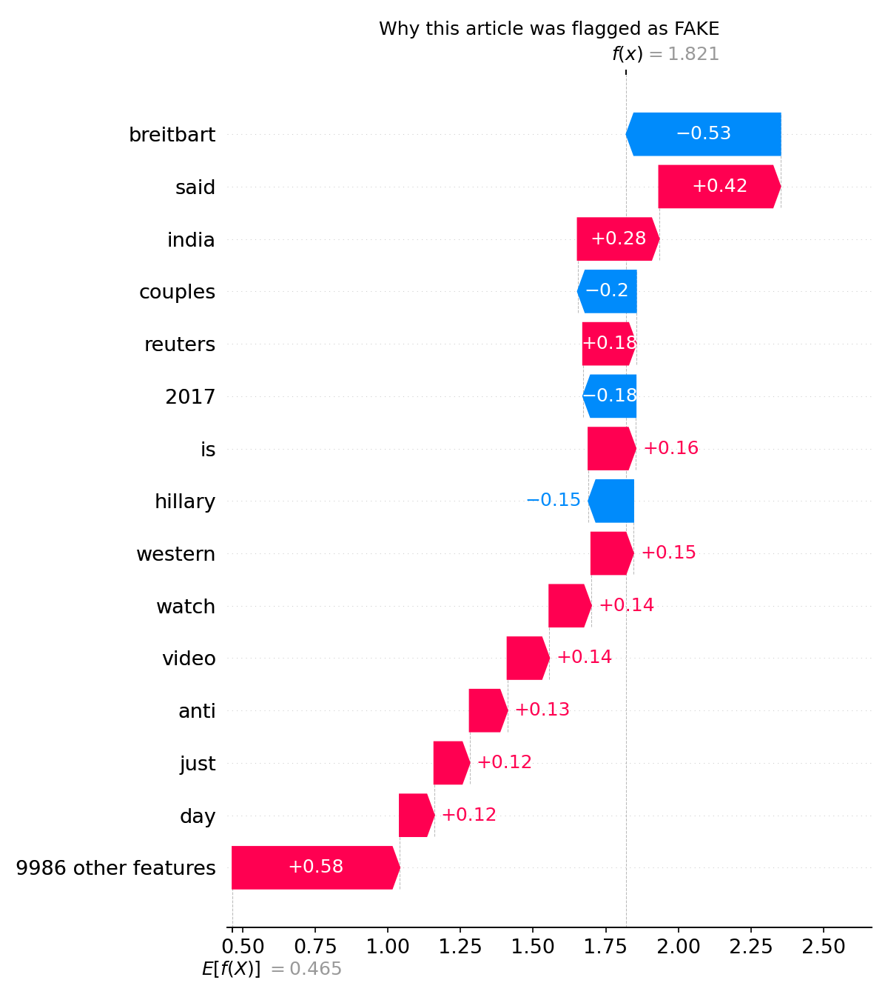

# Fake News Detector 🔍

A machine learning web app that detects fake news articles and explains **why** using SHAP explainability.


## Demo

> Paste any news headline or article → get a Fake/Real verdict + SHAP explanation of which words drove the decision.



---

## How it works

1. **Data** — WELFake dataset (72,134 articles, balanced fake/real labels)
2. **Feature engineering** — article title + body text combined, TF-IDF vectorized (10k features, bigrams)
3. **Model** — Logistic Regression (95% accuracy, balanced precision/recall)
4. **Explainability** — SHAP LinearExplainer shows per-word contribution to each prediction

---

## Project structure

fake-news-detector/
├── app.py              # Streamlit web app
├── data.py             # Load & split WELFake dataset
├── preprocess.py       # Clean & prepare data
├── model.py            # Train & evaluate model
├── explain.py          # Generate SHAP plots
├── model.pkl           # Saved trained model
├── shap_global.png     # Global feature importance plot
├── shap_local.png      # Local SHAP waterfall example
└── requirements.txt    # Dependencies

---

## Setup & run locally

### 1. Clone the repo
```bash
git clone https://github.com/YOUR_USERNAME/fake-news-detector.git
cd fake-news-detector
```

### 2. Create virtual environment
```bash
python -m venv venv

# Windows
venv\Scripts\activate

# Mac/Linux
source venv/bin/activate
```

### 3. Install dependencies
```bash
pip install -r requirements.txt
```

### 4. Download the dataset
Download [WELFake_Dataset.csv](https://huggingface.co/datasets/davanstrien/WELFake) and place it in a `data/` folder.

### 5. Train the model (optional — model.pkl already included)
```bash
python data.py
python model.py
```

### 6. Run the app
```bash
streamlit run app.py
```

Opens at `http://localhost:8501`

---

## Results

| Metric | Fake | Real |
|--------|------|------|
| Precision | 0.96 | 0.95 |
| Recall | 0.94 | 0.96 |
| F1-score | 0.95 | 0.95 |
| **Accuracy** | | **95%** |

---

## Key insight from SHAP

The model learned that **source attribution words** ("reuters", "said", "according") are strong signals for real news, while certain partisan source names push strongly toward fake. This emergent source-bias detection happened without explicitly providing source labels — only raw text.

---

## Tech stack

- `scikit-learn` — TF-IDF + Logistic Regression
- `shap` — model explainability
- `streamlit` — web app
- `pandas` / `numpy` — data processing
- `matplotlib` — visualizations